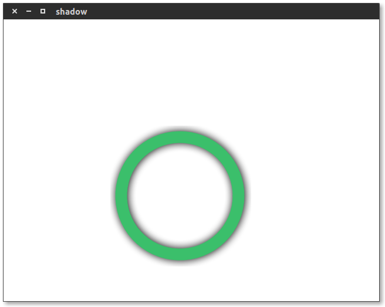
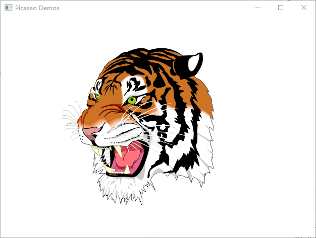
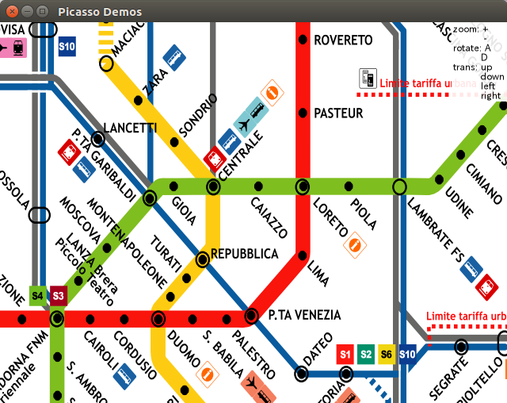
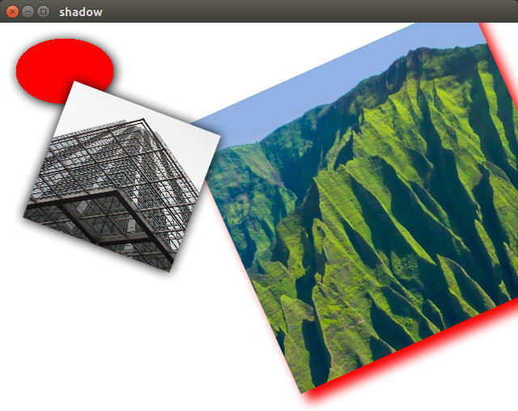
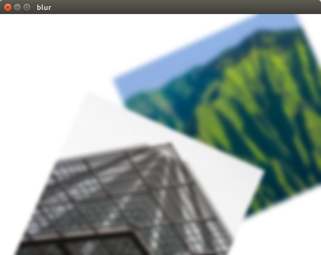
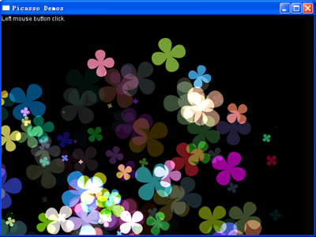

Picasso 是一款跨平台的高级二维矢量绘图引擎。Picasso提供平台无关的图形渲染技术，使它可以运行在几乎所有操作系统平台。目前支持的平台包括Windows 、 WindowsCE、 Linux。Picasso提供低层次，轻量级的二维矢量图形渲染技术，可以为不同是设备提供一致的图形输出质量。Picasso的API非常简单并且易于使用，可以支持很多高级二维图形操作，包括 Path, Transform, Gradient, Pattern, Image 和 Truetype 字体等功能，支持多种颜色模式和混合方式, 可以用在需要矢量图形操作的软件里。
### 原作者信息
- [作者的CSDN博客] (http://blog.csdn.net/onecoolx/article/details/9156531)
 
- [Picasso - Github] (https://github.com/onecoolx/picasso)

=================================================
### 修改内容：
*   gyp在Linux上的编译存在问题， 将gyp移植到了premake4。
*   premake已经支持 Linux，Windows应用程序(平台Win10, VS2015)。
*   修改部分源文件，避免在Linux Windows上编译时发生的一些错误。
*   编译后的示例都在bin目录，其中有两个运行脚本。
*   如果是Linux 需要 freetype fonconfig， 编译示例还需要gtk2.0 的dev软件包。
*   Re De emailto:m45407836@163.com
*   编译方法

``` bash
premake4 gmake #Linux 
cd proj
make #通过make help 命令获得更多选项
cd ../bin #运行相关的示例
#======================
premake4 vs2012 #windows 
cd ../proj #打开picasso.sln
```

=================================================
### 代码示例

``` c
void draw_test (int id, ps_context* gc)
{
    ps_rect cr2 = {200,200,200,200};
    ps_color col = {0.23, 0.75, 0.42, 1};
    ps_color sol = {0, 0, 0, 1};
    ps_identity(gc);
    ps_set_path(gc, pa);
    ps_set_shadow(gc, 2, 1, 0.375f);
    ps_set_shadow_color(gc, &sol);
    ps_set_stroke_color(gc, &col);
    ps_set_line_width(gc, 20);
    ps_stroke(gc);
    ps_reset_shadow(gc);
}
void init_context (ps_context* gc, ps_canvas* cs, unsigned char* buf)
{
    float version = (float)ps_version() / 10000;
    fprintf(stderr, "picasso version %.2f\n", version);
	ps_point point = {300,300};
    //创建路径
    pa = ps_path_create();
    ps_path_add_arc(pa, &point, 100, 0, 6.29, 1);
    //=======================
    pm = ps_matrix_create();
}
```


=================================================
### **svg rendering**


### **gis maps**


### **shadow**


### **blur**


### **alpha blending**


